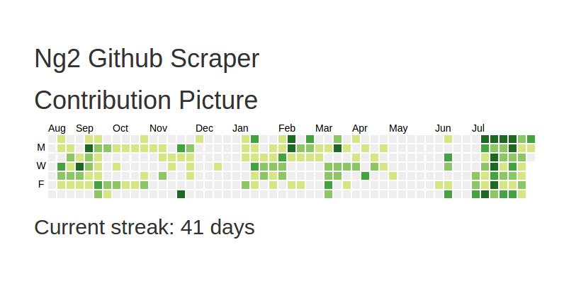

# Playground for developing Ng2 Github Scraper

## Local installation instructions

- Clone repo
- `npm install`
- `gulp` will start a browersync session

You can change the link in the `app.js` file to match your username -->https://github.com/users/YOUR_USERNAME/contributions

## Why?

Github removed the day streak from a users profile. This application will retrieve the image of the contribution graph and scrape it for the current streak.

